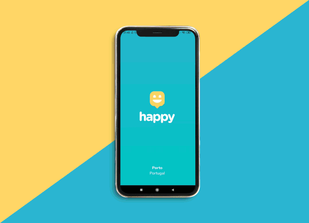

<h3 align="center">
    
    <br>
</h3>

# :books: Table of Contents

- [About](#about)
- [Technologies](#technologies)
- [How to run](#how-to-run)
- [How to Contribute](#how-to-contribute)

<a id="about"></a>

## :star: About

<p style="text-align: center;">The <strong>Happy</strong> project was developed during the Next Level Week, by Rocketseat, during the 12th to the 18th of October.
The project is inspired by Charities.</p>

<a id="technologies"></a>

## :fire: Technologies

The project was developed using the following technologies:

- [TypeScript](https://www.typescriptlang.org/)
- [React](https://pt-br.reactjs.org/)
- [Styled Components](https://styled-components.com/)
- [Node.js](https://nodejs.org/en/)
- [SQLite](https://www.sqlite.org/index.html)
- [Express](https://expressjs.com/)
- [HTML](https://html.com/)
- [CSS](https://developer.mozilla.org/pt-BR/docs/Web/CSS)
- [JavaScript](https://www.javascript.com/)

<a id="how-to-run"></a>

## :arrow_forward: How to run

### :computer: Front-End - Web Application
To start the **application** clone this repository:
```bash 
$ git clone https://github.com/jesspsilva/Happy-Web
```
Then use the commands bellow:
```bash
cd Happy-Web/web
yarn install
yarn start
```
After this process the `localhost: 3000` page will automatically open in your browser or acsess <a href="http://127.0.0.1:3000" target="_blank">http://127.0.0.1:3000</a>

#### <b>Note</b>:
To integrate the map on the application please update the .env.example with your token.
You can acess <a href="https://account.mapbox.com/auth/signin/" target="_blank"><b>Mapbox</b></a> and create a <b>free</b> account.
Then go to:
- Access tokens (on you account page)
- Copy the token to the env file
- Rename the file to '.env'
- Start the project

### :globe_with_meridians: Back-End - API server
Install the backend dependencies:
```bash
cd Happy-Web/backend
yarn install
yarn typeorm migration:run  // creating the tables on happy table
yarn dev
```
Go to <a href="http://127.0.0.1:3333/orphanages" target="_blank">http://127.0.0.1:3333/orphanages</a> to view

You can see it on <a href="https://insomnia.rest/run/?label=Happy-API&uri=https%3A%2F%2Fraw.githubusercontent.com%2Fraphabarreto%2Fhappy-server%2Fmain%2FHappy-Insomnia.json" target="_blank"><b>Insomnia</b></a>

### :iphone: Mobile
Run the commands bellow:
```bash
cd Happy-Web/mobile
yarn install
yarn start
```
After doing this, the metro bundler will open in your browser. From now on you have a few options to access the app.

#### 1. Android Emulator
On the metro bundler page, click on <b>"Run on Android device / emulator"</b> and wait to load. Keep in mind that you must have gone through the android sdk installation process, etc.
#### 2. IOS emulator
On the metro bundler page, click on <b>"Run on iOS simulator"</b> and wait to load.
#### 3. Your phone (recommended)
Download the expo app:
<a href="https://apps.apple.com/app/apple-store/id982107779">IOS</a>
<a href="https://play.google.com/store/apps/details?id=host.exp.exponent&referrer=www">Android</a>

After downloading, go back to the metro bundler page and scan the QR Code with the Expo app.

If everything went well, the app should be available now! :tada: :confetti_ball:

#### Final Result


<a id="how-to-contribute"></a>

## :yellow_heart: How to contribute
1. Fork this repository;
2. Create a branch with your feature: `git checkout -b my-feature`
3. Commit your changes: `git commit -m 'Describe your new feature'`
4. Push your branch: `git push origin my-feature`

## :scroll: License

This project is under the MIT license. See the [licence page](https://opensource.org/licenses/MIT) for more details.

If you like it, leave a :star: !
